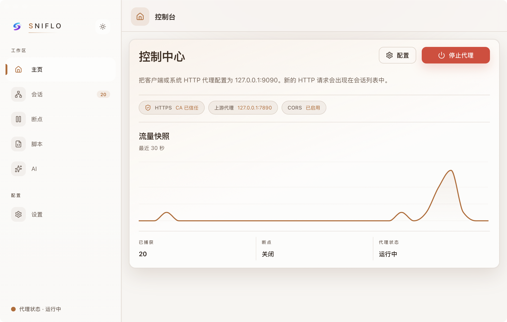
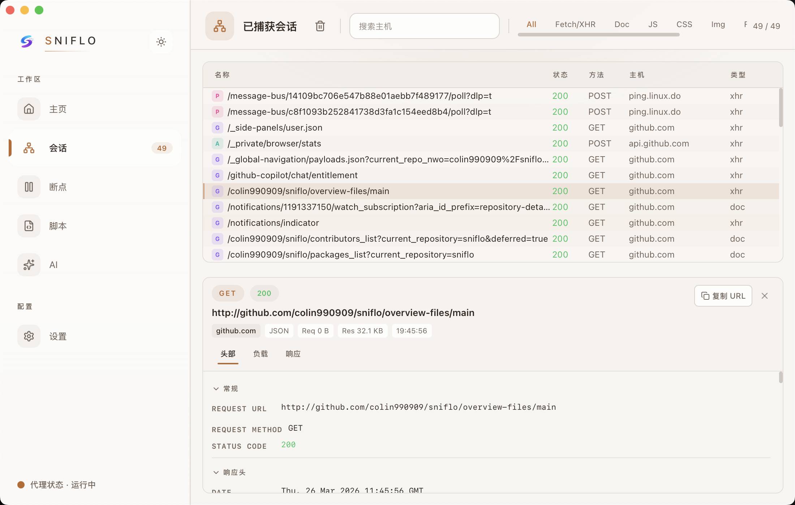
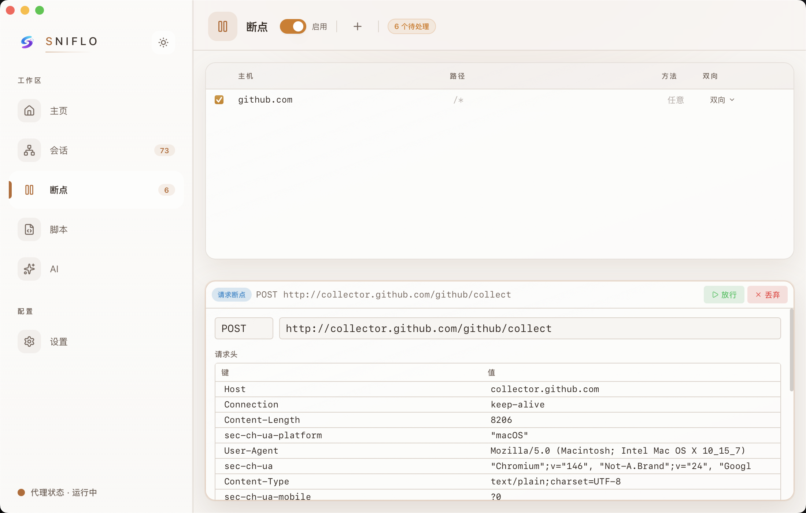
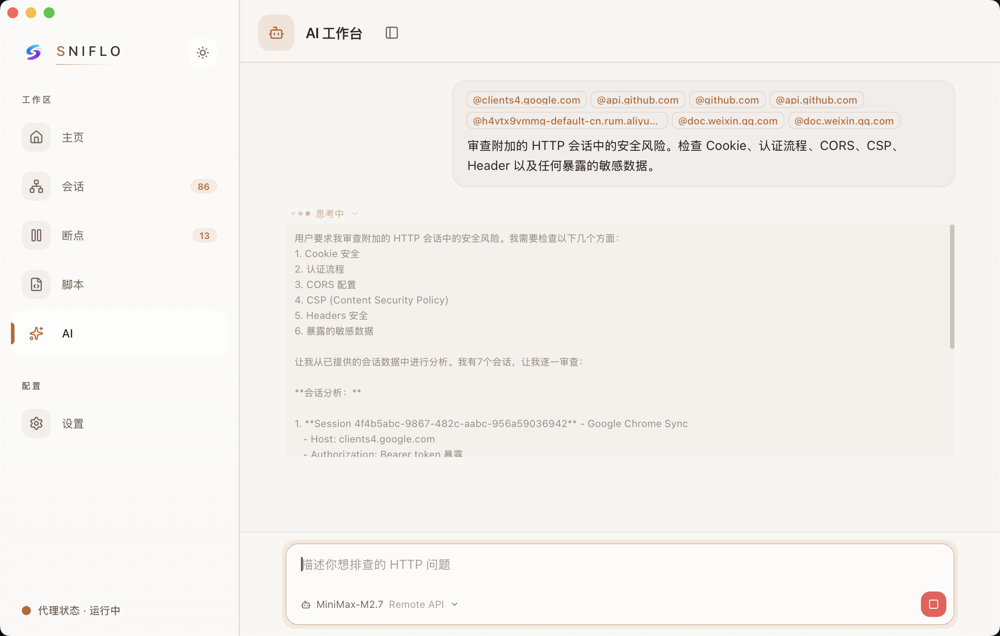
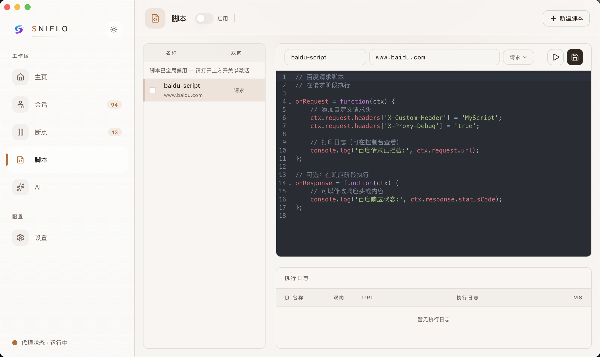

<p align="center">
  
</p>

<h1 align="center">Sniflo</h1>

<p align="center">
  AI 驱动的跨平台 HTTP 代理调试器<br/>
  让 AI 理解你的每一条网络请求
</p>

<p align="center">
  <a href="https://github.com/colin990909/sniflo/releases">下载</a> |
  <a href="#功能特性">功能特性</a> |
  <a href="#快速开始">快速开始</a> |
  <a href="./README.md">English</a>
</p>

---



## 功能特性

- **HTTP/HTTPS 流量拦截** — 通过自动生成的 CA 证书实现 MITM，捕获并检查所有 HTTP 流量
- **请求/响应查看器** — 详细的 Headers、Body（语法高亮）、时序和元数据检查
- **断点调试** — 实时暂停并修改请求/响应，支持灵活的规则配置
- **JavaScript 脚本引擎** — 内嵌 Boa JS 引擎，支持通过脚本自动化修改流量，内置代码编辑器
- **AI 分析工作区** — 多 AI 服务商支持（Claude、OpenAI、Claude Code CLI、Codex CLI），可注入会话上下文并调用工具
- **多格式导出** — 支持将抓包会话导出为 cURL 命令、HAR 或 JSON 格式
- **上游代理** — 支持通过 HTTP/SOCKS5 上游代理转发流量
- **证书管理** — 一键生成、安装和管理 CA 证书
- **国际化** — 完整的中英文本地化支持
- **深色/浅色主题** — 精心设计的 UI，基于自定义设计令牌系统

### 界面截图

| 会话列表 | 断点编辑器 |
|---------|----------|
|  |  |

| AI 工作区 | 脚本编辑器 |
|----------|----------|
|  |  |

## 技术栈

| 层级     | 技术                                                           |
|----------|----------------------------------------------------------------|
| 前端     | React 19, TypeScript, Vite 5, Tailwind CSS, Zustand, Radix UI |
| 后端     | Tauri v2, Rust, Tokio, rustls, SQLite (rusqlite)               |
| 代理核心 | 基于 rcgen + tokio-rustls 的自定义 HTTP/HTTPS MITM 代理          |
| AI       | Anthropic API, OpenAI API, Claude Code CLI, Codex CLI          |
| 脚本     | Boa（嵌入式 ECMAScript 引擎）                                    |

## 项目结构

```text
.
├── frontend/
│   ├── src/                  # React 前端
│   │   ├── components/       # 可复用 UI 组件（基于 Radix）
│   │   ├── views/            # 页面级组件
│   │   ├── stores/           # Zustand 状态管理
│   │   ├── hooks/            # 自定义 React Hooks
│   │   ├── i18n/             # 国际化（en, zh-Hans）
│   │   └── lib/              # 工具函数
│   └── src-tauri/
│       └── src/
│           ├── commands/      # Tauri 命令处理
│           ├── proxy_core/    # HTTP/HTTPS 代理 + MITM
│           ├── ai/            # AI 子系统（Agent、Provider、Tools）
│           ├── scripting/     # Boa JS 引擎集成
│           └── storage/       # SQLite 持久层
├── .github/workflows/         # CI + 发布构建
└── docs/                      # 文档与截图
```

## 快速开始

### 环境要求

- [Node.js](https://nodejs.org/) >= 18
- [Rust](https://rustup.rs/) 稳定版工具链
- [Tauri v2 系统依赖](https://v2.tauri.app/start/prerequisites/)

### 开发

```bash
cd frontend && npm install

# 启动完整应用（前端 + 后端）
npm run tauri dev

# 或仅启动前端
npm run dev
```

### 构建

```bash
cd frontend && npm run tauri build
```

### 测试

```bash
# 前端测试
cd frontend && npx vitest run

# TypeScript 类型检查
cd frontend && npx tsc --noEmit

# Rust 检查
cargo clippy --all-targets -- -D warnings
cargo fmt --all --check
cargo test --manifest-path frontend/src-tauri/Cargo.toml
```

## 下载

可在 [Releases](https://github.com/colin990909/sniflo/releases) 页面下载预构建的安装包：

- macOS（Apple Silicon / Intel）
- Windows
- Linux

## Star 趋势

<a href="https://www.star-history.com/?repos=colin990909%2Fsniflo&type=date&legend=top-left">
 <picture>
   <source media="(prefers-color-scheme: dark)" srcset="https://api.star-history.com/image?repos=colin990909/sniflo&type=date&theme=dark&legend=top-left" />
   <source media="(prefers-color-scheme: light)" srcset="https://api.star-history.com/image?repos=colin990909/sniflo&type=date&legend=top-left" />
   
 </picture>
</a>

## 参与贡献

请参阅 [CONTRIBUTING.md](CONTRIBUTING.md) 了解贡献指南。

## 安全

请参阅 [SECURITY.md](SECURITY.md) 了解漏洞报告流程。

## 许可证

[MIT](LICENSE) - Copyright 2026 Colin
